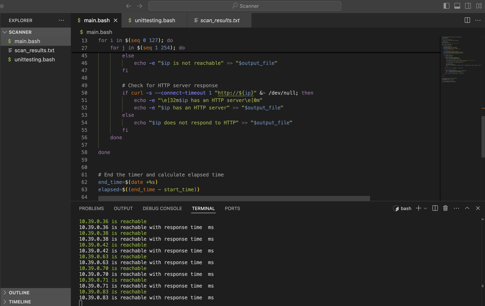

# IP Network Scanner

A simple IP network scanner built in Bash to identify active hosts within a specified range on a local network. It leverages ping or TCP requests to detect active IP addresses.

### Features
- Scans a range of IP addresses on a local network.
- Identifies active hosts by sending probe requests.
- Configurable scanning range and timeout settings.
- Finds open ports and HTTP server responses.
- Logs all data to a `.txt` file.

### Requirements
- Bash shell
- Root/admin privileges for certain network operations
